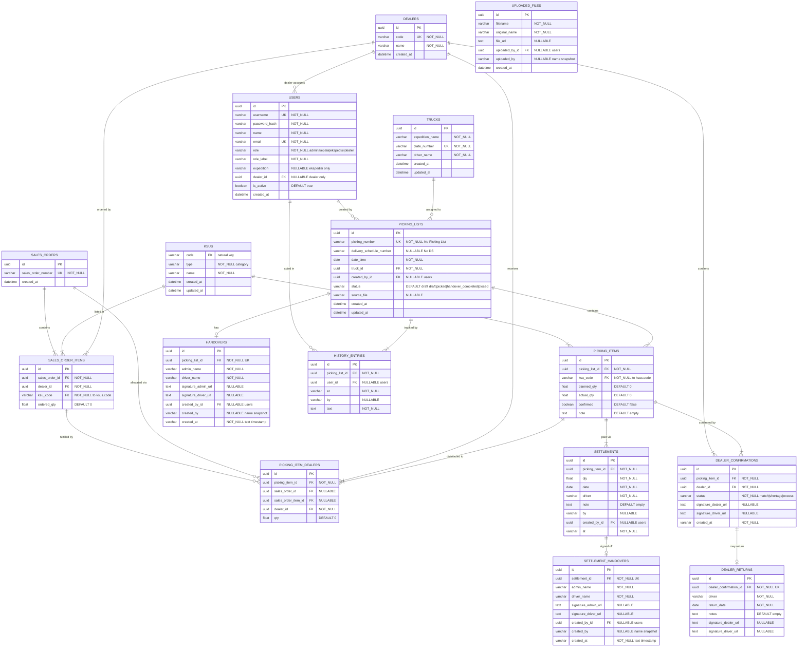

# Database Schema

> Normalized schema for the Picking Control Gudang application.
> Data is seeded from Excel imports; master tables are upserted during import.
> Schema source of truth: `app/models/__init__.py` (Alembic migration `c1a4f7b2d901` mirrors it via `Base.metadata`).

---

## ERD Diagram



### Design notes

- **`ksus` uses its natural key (`code`) as primary key** — no surrogate UUID duplicating the business key. `picking_items.ksu_code` and `sales_order_items.ksu_code` reference it directly.
- **`sales_order_items`** is the normalized SO line: one sales order can contain many (dealer, KSU) lines, each with its own `ordered_qty`. Uniqueness is enforced per `(sales_order_id, dealer_id, ksu_code)`; re-imports accumulate quantity instead of duplicating rows.
- **No snapshot columns on `picking_items`** — item name/category always come from `ksus` via the `ksu_code` FK (eager-loaded with `lazy="joined"`), so master corrections apply everywhere.
- **No `sales_order_dealers` / `picking_list_sales_orders` join tables** — the SO↔dealer and SO↔picking-list links are fully derivable from `sales_order_items` and `picking_item_dealers.sales_order_id` respectively.
- **Audit references are FKs**: `created_by_id` / `user_id` / `uploaded_by_id` point at `users.id`; the parallel `created_by` / `by` / `uploaded_by` name columns are kept as display snapshots.
- **Dates are typed** (`Date`) in `picking_lists`, `settlements`, and `dealer_returns`; older text timestamps in `handovers`/`settlements.at` remain for API compatibility.

---

## Views (planned — not yet created)

> These are the target definitions from the open TODO item; column names match the current schema.

### `v_picking_totals`

Aggregated totals per picking list. Used by dashboard stats and debt calculations.

```sql
CREATE OR REPLACE VIEW v_picking_totals AS
SELECT
    pl.id AS picking_list_id,
    pl.picking_number,
    pl.date_time,
    pl.status,
    t.expedition_name,
    t.plate_number,
    t.driver_name,
    COALESCE(SUM(pi.planned_qty), 0) AS total_planned,
    COALESCE(SUM(pi.actual_qty), 0) AS total_actual,
    COALESCE(SUM(pi.confirmed::int), 0) AS confirmed_count,
    COUNT(pi.id) AS total_items,
    CASE
        WHEN pl.status IN ('picked', 'handover_completed', 'closed')
        THEN GREATEST(
            COALESCE(SUM(pi.planned_qty), 0)
            - COALESCE(SUM(pi.actual_qty), 0)
            - COALESCE((SELECT SUM(s.qty) FROM settlements s WHERE s.picking_item_id = pi.id), 0),
            0
        )
        ELSE 0
    END AS total_debt
FROM picking_lists pl
LEFT JOIN trucks t ON t.id = pl.truck_id
LEFT JOIN picking_items pi ON pi.picking_list_id = pl.id
GROUP BY pl.id, t.expedition_name, t.plate_number, t.driver_name;
```

### `v_item_dealer_summary`

Per-item dealer distribution. Used by dealer page and dashboard dealer summary.

```sql
CREATE OR REPLACE VIEW v_item_dealer_summary AS
SELECT
    pi.id AS picking_item_id,
    pi.ksu_code AS item_code,
    k.name AS item_name,
    k.type AS item_category,
    pi.planned_qty,
    pi.actual_qty,
    pl.picking_number,
    pl.date_time,
    t.driver_name,
    t.expedition_name,
    d.id AS dealer_id,
    d.code AS dealer_code,
    d.name AS dealer_name,
    pid.qty AS dealer_qty,
    so.sales_order_number AS no_so,
    dc.status AS confirmation_status
FROM picking_items pi
JOIN ksus k ON k.code = pi.ksu_code
JOIN picking_lists pl ON pl.id = pi.picking_list_id
LEFT JOIN trucks t ON t.id = pl.truck_id
JOIN picking_item_dealers pid ON pid.picking_item_id = pi.id
JOIN dealers d ON d.id = pid.dealer_id
LEFT JOIN sales_orders so ON so.id = pid.sales_order_id
LEFT JOIN dealer_confirmations dc ON dc.picking_item_id = pi.id AND dc.dealer_id = d.id;
```

### `v_expedition_stats`

Per-expedition breakdown. Used by dashboard expedition table.

```sql
CREATE OR REPLACE VIEW v_expedition_stats AS
SELECT
    t.expedition_name,
    t.plate_number,
    t.driver_name,
    COUNT(pl.id) AS total_lists,
    COUNT(pl.id) FILTER (WHERE pl.status = 'draft') AS draft_count,
    COUNT(pl.id) FILTER (WHERE pl.status = 'picked') AS picked_count,
    COUNT(h.id) AS handover_count,
    COALESCE(SUM(vpt.total_planned), 0) AS total_items,
    COALESCE(SUM(vpt.total_debt), 0) AS total_debt
FROM trucks t
LEFT JOIN picking_lists pl ON pl.truck_id = t.id
LEFT JOIN handovers h ON h.picking_list_id = pl.id
LEFT JOIN v_picking_totals vpt ON vpt.picking_list_id = pl.id
GROUP BY t.id, t.expedition_name, t.plate_number, t.driver_name;
```

### `v_driver_stats`

Per-driver breakdown. Used by dashboard driver table.

```sql
CREATE OR REPLACE VIEW v_driver_stats AS
SELECT
    t.driver_name,
    t.expedition_name,
    COUNT(pl.id) AS total_lists,
    COUNT(pl.id) FILTER (WHERE pl.status = 'draft') AS draft_count,
    COUNT(pl.id) FILTER (WHERE pl.status = 'picked') AS picked_count,
    COUNT(h.id) AS handover_count,
    COALESCE(SUM(vpt.total_planned), 0) AS total_items,
    COALESCE(SUM(vpt.total_debt), 0) AS total_debt
FROM trucks t
LEFT JOIN picking_lists pl ON pl.truck_id = t.id
LEFT JOIN handovers h ON h.picking_list_id = pl.id
LEFT JOIN v_picking_totals vpt ON vpt.picking_list_id = pl.id
GROUP BY t.id, t.driver_name, t.expedition_name;
```

### `v_dealer_confirmation_stats`

Dealer confirmation summary. Used by dashboard dealer summary.

```sql
CREATE OR REPLACE VIEW v_dealer_confirmation_stats AS
SELECT
    d.id AS dealer_id,
    d.code AS dealer_code,
    d.name AS dealer_name,
    COUNT(pi.id) AS total_items,
    COUNT(dc.id) FILTER (WHERE dc.status = 'match') AS match_count,
    COUNT(dc.id) FILTER (WHERE dc.status = 'shortage') AS shortage_count,
    COUNT(dc.id) FILTER (WHERE dc.status = 'excess') AS excess_count,
    COUNT(pi.id) - COUNT(dc.id) AS pending_count
FROM dealers d
JOIN picking_item_dealers pid ON pid.dealer_id = d.id
JOIN picking_items pi ON pi.id = pid.picking_item_id
LEFT JOIN dealer_confirmations dc ON dc.picking_item_id = pi.id AND dc.dealer_id = d.id
GROUP BY d.id, d.code, d.name;
```

---

## Table Summary

| Category | Table | Purpose |
|----------|-------|---------|
| **Master** | `users` | Authentication & roles (FK to dealers) |
| **Master** | `trucks` | Expedition/plate/driver lookup (unique plate) |
| **Master** | `ksus` | Product catalog, natural key `code` |
| **Master** | `dealers` | Dealer directory |
| **Master** | `sales_orders` | Sales order headers (number only) |
| **Master** | `sales_order_items` | SO lines: (order, dealer, KSU) + ordered qty |
| **Transaction** | `picking_lists` | Picking list headers (FK truck, created_by) |
| **Transaction** | `picking_items` | Picking list line items (FK ksu_code) |
| **Transaction** | `picking_item_dealers` | Dealer allocations per item (FK dealer, sales_order, sales_order_item) |
| **Operational** | `handovers` | Admin → driver sign-off |
| **Operational** | `settlements` | Debt payment records |
| **Operational** | `settlement_handovers` | Settlement sign-off |
| **Operational** | `dealer_confirmations` | Dealer receipt status (FK dealer) |
| **Operational** | `dealer_returns` | Return records |
| **Operational** | `history_entries` | Audit trail (FK user) |
| **Operational** | `uploaded_files` | File upload tracking |
| **View** | `v_picking_totals` | Aggregated totals per list (planned) |
| **View** | `v_item_dealer_summary` | Item → dealer distribution (planned) |
| **View** | `v_expedition_stats` | Per-expedition breakdown (planned) |
| **View** | `v_driver_stats` | Per-driver breakdown (planned) |
| **View** | `v_dealer_confirmation_stats` | Dealer confirmation summary (planned) |

---

## Import Flow

When an Excel file is uploaded:

1. **Parse Excel** → extract picking lists, items, dealer assignments
2. **Upsert `trucks`** → deduplicate by `plate_number` (unique)
3. **Upsert `ksus`** → deduplicate by `code` (primary key); refresh `name`/`type` from the file
4. **Upsert `dealers`** → deduplicate by `code`; refresh `name`
5. **Upsert `sales_orders`** → deduplicate by `sales_order_number`
6. **Upsert `sales_order_items`** → deduplicate by (`sales_order_id`, `dealer_id`, `ksu_code`); accumulate `ordered_qty` on repeat
7. **Insert `picking_lists`** → FK to `truck_id`
8. **Insert `picking_items`** → FK to `ksu_code`
9. **Insert `picking_item_dealers`** → FK to `dealer_id`, `sales_order_id`, `sales_order_item_id`
10. **Insert `history_entries`** → audit trail

All master table operations are **upsert** (insert or update) so re-importing the same Excel doesn't create duplicates. Unique constraints at the DB level (`uq_sales_order_item_dealer_ksu`, `uq_picking_item_dealer_sales_order`, `uq_dealer_confirmation_item_dealer`) guard the same rules for any other write path.
