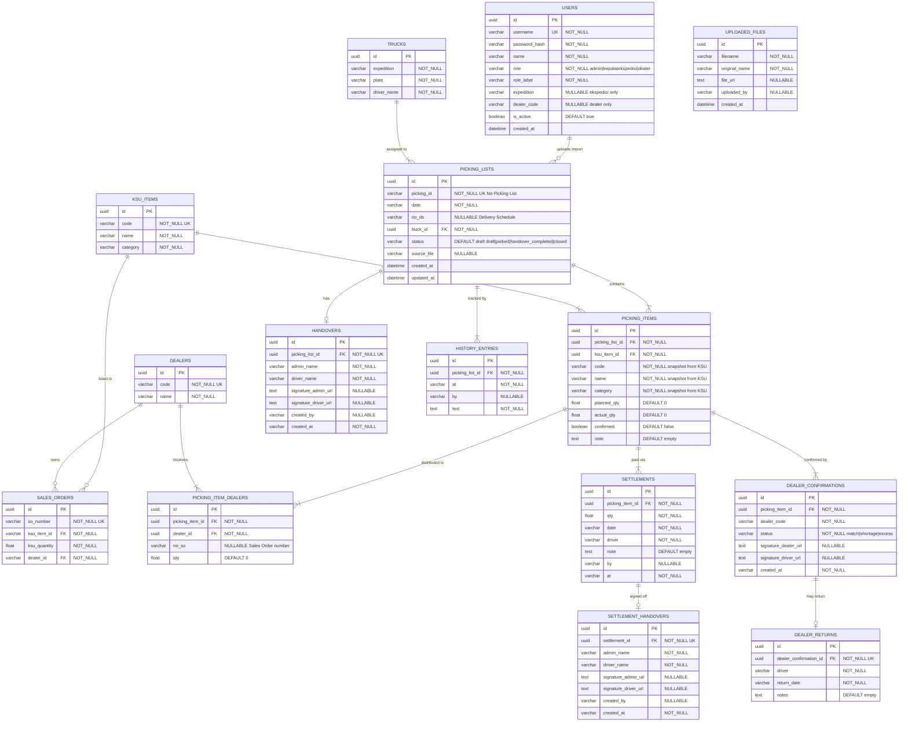

# Database Schema

> Normalized schema for the Picking Control Gudang application.
> All data is seeded from Excel imports. Master tables are auto-created during import.

---

## ERD Diagram



---

## Views

### `v_picking_totals`

Aggregated totals per picking list. Used by dashboard stats and debt calculations.

```sql
CREATE OR REPLACE VIEW v_picking_totals AS
SELECT
    pl.id AS picking_list_id,
    pl.picking_id,
    pl.date,
    pl.status,
    pl.expedition,
    pl.driver,
    COALESCE(SUM(pi.planned_qty), 0) AS total_planned,
    COALESCE(SUM(pi.actual_qty), 0) AS total_actual,
    COALESCE(SUM(pi.confirmed::int), 0) AS confirmed_count,
    COUNT(pi.id) AS total_items,
    CASE
        WHEN pl.status IN ('picked', 'handover_completed', 'closed')
        THEN GREATEST(
            COALESCE(SUM(pi.planned_qty), 0)
            - COALESCE(SUM(pi.actual_qty), 0)
            - COALESCE((SELECT SUM(s.qty) FROM settlements s WHERE s.picking_item_id = pi.id), 0),
            0
        )
        ELSE 0
    END AS total_debt
FROM picking_lists pl
LEFT JOIN picking_items pi ON pi.picking_list_id = pl.id
GROUP BY pl.id;
```

### `v_item_dealer_summary`

Per-item dealer distribution. Used by dealer page and dashboard dealer summary.

```sql
CREATE OR REPLACE VIEW v_item_dealer_summary AS
SELECT
    pi.id AS picking_item_id,
    pi.code AS item_code,
    pi.name AS item_name,
    pi.category AS item_category,
    pi.planned_qty,
    pi.actual_qty,
    pl.picking_id,
    pl.date,
    pl.driver,
    pl.expedition,
    d.id AS dealer_id,
    d.code AS dealer_code,
    d.name AS dealer_name,
    pid.qty AS dealer_qty,
    pid.no_so,
    dc.status AS confirmation_status
FROM picking_items pi
JOIN picking_lists pl ON pl.id = pi.picking_list_id
JOIN picking_item_dealers pid ON pid.picking_item_id = pi.id
JOIN dealers d ON d.id = pid.dealer_id
LEFT JOIN dealer_confirmations dc ON dc.picking_item_id = pi.id AND dc.dealer_code = d.code;
```

### `v_expedition_stats`

Per-expedition breakdown. Used by dashboard expedition table.

```sql
CREATE OR REPLACE VIEW v_expedition_stats AS
SELECT
    t.expedition,
    t.plate,
    t.driver_name,
    COUNT(pl.id) AS total_lists,
    COUNT(pl.id) FILTER (WHERE pl.status = 'draft') AS draft_count,
    COUNT(pl.id) FILTER (WHERE pl.status = 'picked') AS picked_count,
    COUNT(pl.id) FILTER (WHERE pl.handover_id IS NOT NULL) AS handover_count,
    COALESCE(SUM(vpt.total_planned), 0) AS total_items,
    COALESCE(SUM(vpt.total_debt), 0) AS total_debt
FROM trucks t
LEFT JOIN picking_lists pl ON pl.truck_id = t.id
LEFT JOIN v_picking_totals vpt ON vpt.picking_list_id = pl.id
GROUP BY t.id, t.expedition, t.plate, t.driver_name;
```

### `v_driver_stats`

Per-driver breakdown. Used by dashboard driver table.

```sql
CREATE OR REPLACE VIEW v_driver_stats AS
SELECT
    t.driver_name,
    t.expedition,
    COUNT(pl.id) AS total_lists,
    COUNT(pl.id) FILTER (WHERE pl.status = 'draft') AS draft_count,
    COUNT(pl.id) FILTER (WHERE pl.status = 'picked') AS picked_count,
    COUNT(pl.id) FILTER (WHERE pl.handover_id IS NOT NULL) AS handover_count,
    COALESCE(SUM(vpt.total_planned), 0) AS total_items,
    COALESCE(SUM(vpt.total_debt), 0) AS total_debt
FROM trucks t
LEFT JOIN picking_lists pl ON pl.truck_id = t.id
LEFT JOIN v_picking_totals vpt ON vpt.picking_list_id = pl.id
GROUP BY t.id, t.driver_name, t.expedition;
```

### `v_dealer_confirmation_stats`

Dealer confirmation summary. Used by dashboard dealer summary.

```sql
CREATE OR REPLACE VIEW v_dealer_confirmation_stats AS
SELECT
    d.id AS dealer_id,
    d.code AS dealer_code,
    d.name AS dealer_name,
    COUNT(pi.id) AS total_items,
    COUNT(dc.id) FILTER (WHERE dc.status = 'match') AS match_count,
    COUNT(dc.id) FILTER (WHERE dc.status = 'shortage') AS shortage_count,
    COUNT(dc.id) FILTER (WHERE dc.status = 'excess') AS excess_count,
    COUNT(pi.id) - COUNT(dc.id) AS pending_count
FROM dealers d
JOIN picking_item_dealers pid ON pid.dealer_id = d.id
JOIN picking_items pi ON pi.id = pid.picking_item_id
LEFT JOIN dealer_confirmations dc ON dc.picking_item_id = pi.id AND dc.dealer_code = d.code
GROUP BY d.id, d.code, d.name;
```

---

## Table Summary

| Category | Table | Purpose |
|----------|-------|---------|
| **Master** | `users` | Authentication & roles |
| **Master** | `trucks` | Expedition/plate/driver lookup |
| **Master** | `ksu_items` | Product catalog (code, name, category) |
| **Master** | `dealers` | Dealer directory |
| **Master** | `sales_orders` | Sales order → product → dealer link |
| **Transaction** | `picking_lists` | Picking list headers |
| **Transaction** | `picking_items` | Picking list line items (with KSU snapshot) |
| **Transaction** | `picking_item_dealers` | Dealer assignments per item |
| **Operational** | `handovers` | Admin → driver sign-off |
| **Operational** | `settlements` | Debt payment records |
| **Operational** | `settlement_handovers` | Settlement sign-off |
| **Operational** | `dealer_confirmations` | Dealer receipt status |
| **Operational** | `dealer_returns` | Return records |
| **Operational** | `history_entries` | Audit trail |
| **Operational** | `uploaded_files` | File upload tracking |
| **View** | `v_picking_totals` | Aggregated totals per list |
| **View** | `v_item_dealer_summary` | Item → dealer distribution |
| **View** | `v_expedition_stats` | Per-expedition breakdown |
| **View** | `v_driver_stats` | Per-driver breakdown |
| **View** | `v_dealer_confirmation_stats` | Dealer confirmation summary |

---

## Import Flow

When an Excel file is uploaded:

1. **Parse Excel** → extract picking lists, items, dealer assignments
2. **Upsert `trucks`** → deduplicate by (expedition, plate, driver_name)
3. **Upsert `ksu_items`** → deduplicate by (code, name, category)
4. **Upsert `dealers`** → deduplicate by (code)
5. **Upsert `sales_orders`** → deduplicate by (so_number) if present
6. **Insert `picking_lists`** → FK to truck_id
7. **Insert `picking_items`** → FK to ksu_item_id, snapshot code/name/category
8. **Insert `picking_item_dealers`** → FK to dealer_id, link to sales order
9. **Insert `history_entries`** → audit trail

All master table operations are **upsert** (insert or update on conflict) so re-importing the same Excel doesn't create duplicates.
